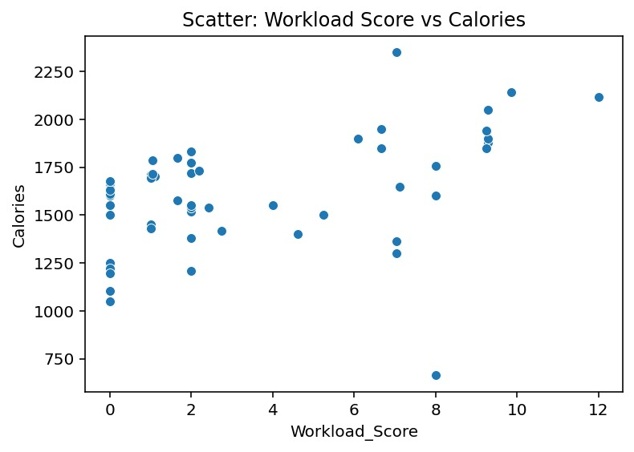
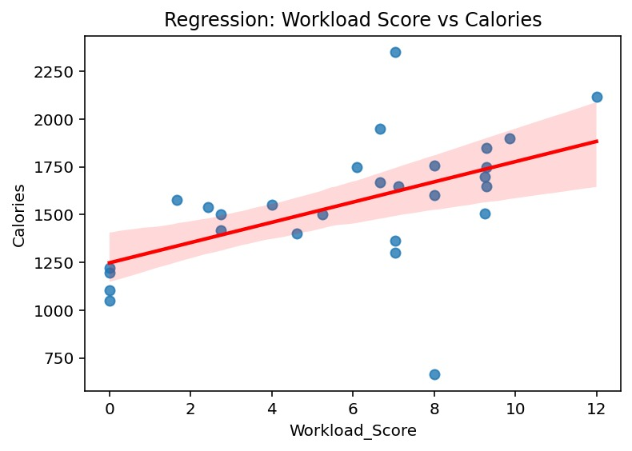
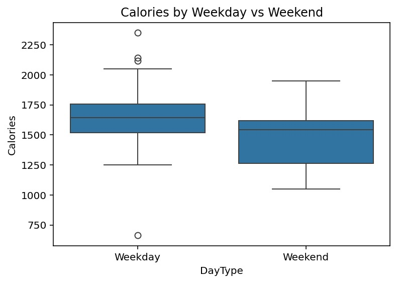
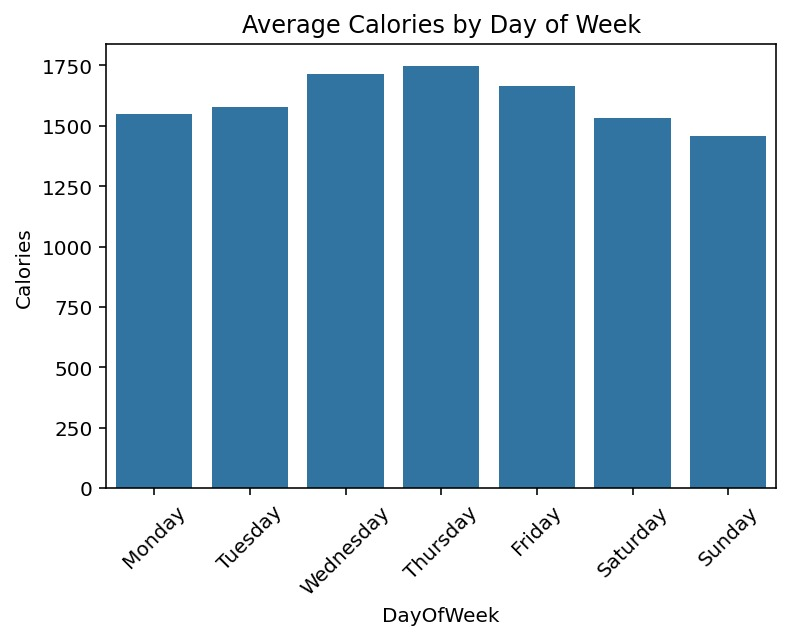
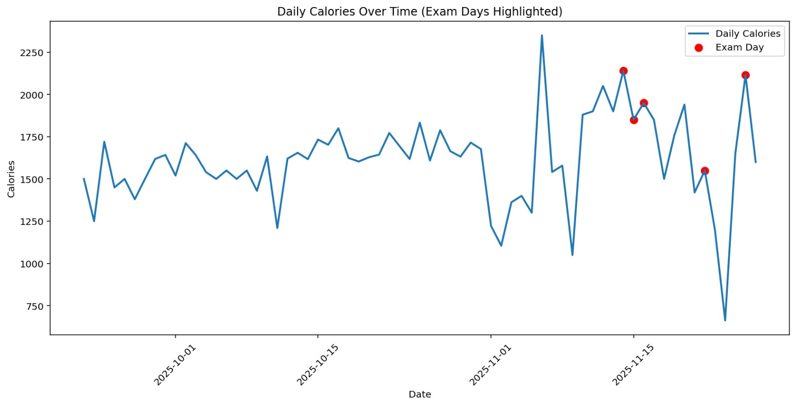
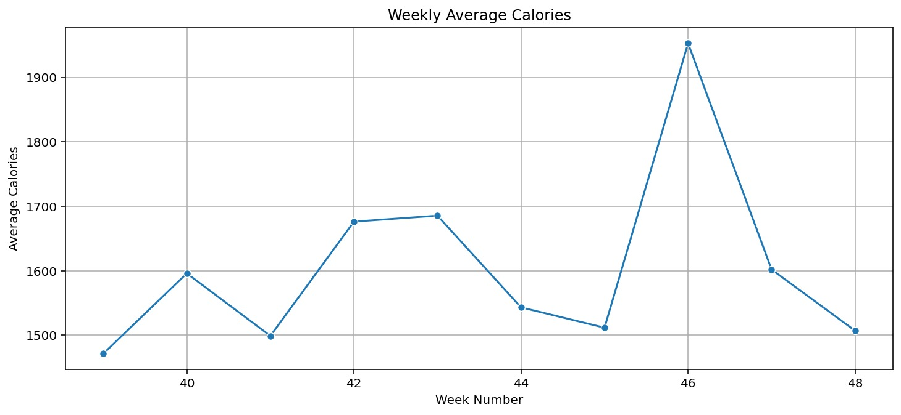
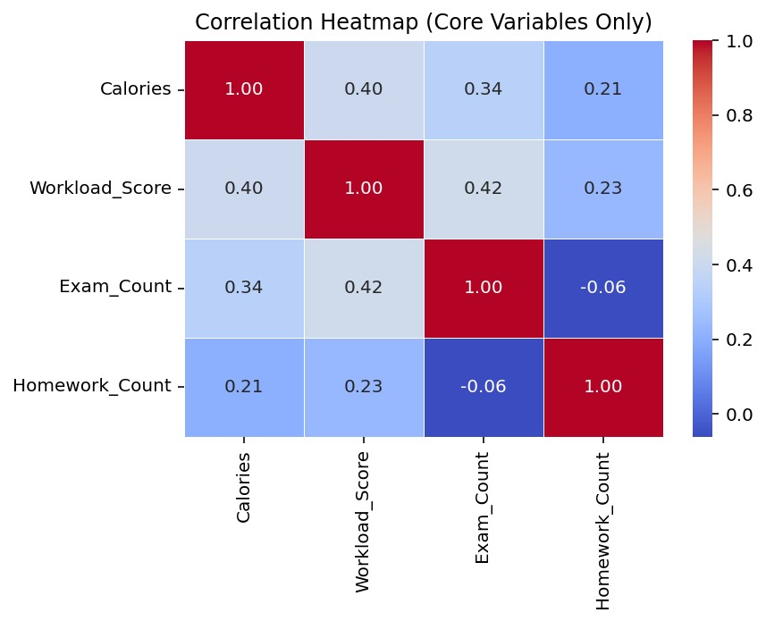

# **Workload–Calorie Correlation Analysis**

This project analyzes how **daily academic workload** affects **calorie intake** using a custom workload scoring model and statistical hypothesis testing.

---

# **1. Research Question**

**Does a higher academic workload lead to increased daily calorie intake?**

---

# **2. Hypotheses**

### **H₁ – Alternative Hypothesis**
Higher workload → higher daily calorie intake.

### **H₀ – Null Hypothesis**
Workload and daily calorie intake are not related.

---

# **3. Dataset Description**

Daily data were collected throughout the academic period (Sept 22 → end of November) from:

1. **Academic workload information from SUCourse+**
2. **Calorie intake from the Yazıo nutrition tracking app**

---

## **3.1 Academic Workload Data (SUCourse+)**

| Variable           | Description                                                       |
| ------------------ | ----------------------------------------------------------------- |
| `Course_Load_Min`  | Lecture minutes attended                                          |
| `Homework_Count`   | Number of homework assignments due                                |
| `Project_Count`    | Number of project tasks                                           |
| `Exam_Count`       | Number of exams taken                                             |
| `Exam_Number_Week` | Weekly exam intensity                                             |

All values were manually collected daily from the SUCourse+ system.

---

## **3.2 Nutrition Data (Yazıo App)**

| Variable   | Description                                      |
| ---------- | ------------------------------------------------ |
| `Calories` | Total daily calories logged in the Yazıo app     |

Calories include all meals and snacks logged by the user.

---

## **3.3 Combined Dataset Structure**

The two sources were merged using a common `Date` column.

---

# **4. Workload Score Model**

Daily workload is computed using a custom scoring formula incorporating:

- Lecture attendance  
- Homework intensity  
- Project workload  
- Exam intensity  
- Combo bonus (HW + Project + Exam same day)  
- Weekly Fatigue Factor (stress accumulation across the week)

### **Final Formula**
\[
\text{Workload Score} = \text{Daily Base Workload} \times \text{Weekly Fatigue Factor}
\]

This produces a **single interpretable metric** capturing overall academic intensity for each day.

---

# **4.1 Logic Behind Workload Weights**

Weights were assigned based on the **relative cognitive burden, time requirement, and stress level** of each academic activity.

### **Lecture Load: Course_Load_Min / 50**
- 50 minutes = 1 academic hour  
- Time-based baseline, prevents lectures from dominating the score  

### **Homework Weight: 1.0 → 1.5 on Exam Days**
Homework is moderate difficulty.  
Increases on exam days due to:

- Added time pressure  
- Cognitive switching  
- Stress amplification  

### **Project Weight: 1.5 → 2.0 on Exam Days**
Projects demand deeper thinking and longer commitment, so they are weighted higher than homework.

### **Exam Weight: 2.5 + (0.7 × Exam_Number_Week)**
Exams are the most stressful component.

- Base = 2.5 → Preparation + performance stress  
- Weekly multiplier → cumulative fatigue during exam-heavy weeks  

### **Combo Bonus: +2 if Homework + Project + Exam occur together**
Captures **nonlinear workload spikes** seen on chaotic academic days.

### **Weekly Fatigue Factor**
Workload often clusters into heavy weeks.  
This multiplier reflects:

- Accumulated stress  
- Decreased recovery time  
- Increasing cognitive load over the week  

---

# **5. Visualization**

---

## **5.1 Scatter: Workload Score vs Calories**
  
**Caption:** Shows raw distribution. Light positive relationship but high variance.

---

## **5.2 Regression Plot: Workload vs Calories**
  
**Caption:** Linear fit indicates a mild upward trend, but correlation strength is weak.

---

## **5.3 Workload Score Distribution**
  
**Caption:** Most days fall into low/medium workload ranges. Few extreme workload days limit statistical power.

---

## **5.4 Weekday vs Weekend Calories**
  
**Caption:** Slightly higher variability on weekends. Average calories remain similar.

---

## **5.5 Average Calories by Day of Week**
  
**Caption:** Lowest intake on structured weekdays, highest on weekends.

---

## **5.6 Average Workload by Day of Week**
  
**Caption:** Tue–Thu show highest workload, consistent with real academic schedules.

---

## **5.7 Daily Calories Over Time (Exam Days Highlighted)**
  
**Caption:** Noticeable calorie spikes on exam days (red points).

---

## **5.8 Weekly Average Calories**
  
**Caption:** Workload-heavy weeks tend to show increased average calories.

---

## **5.9 Correlation Heatmap**
  
**Caption:** Workload Score correlates positively with calories and exam count.

---

# **6. Hypothesis Testing Results**

---

## **6.1 Independent Samples t-Test (Low vs High Workload)**

| Group | Condition | Days |
|-------|----------|------|
| Low Workload | ≤ 3 | 47 |
| High Workload | ≥ 8 | 10 |

**Results:**  
- t-statistic: **−1.7000**  
- p-value: **0.1209**  

**Interpretation:**  
No statistically significant difference.  
High-workload sample size is too small → reduced statistical power.

---

## **6.2 One-Way ANOVA (Low vs Medium vs High Workload)**

**Results:**  
- F-statistic: **5.9362**  
- p-value: **0.0043**  

**Interpretation:**  
Highly significant.  
Workload categories show real differences in calorie intake.

**Trend:**  
- Medium workload → highest calories  
- Low workload → lowest  
- High workload → elevated but small sample size reduces precision  

---

# **7. Summary of Findings**

- **Low vs High t-test:** Not significant  
- ✔ **ANOVA (Low vs Medium vs High):** Significant  

This suggests:

- Binary comparison masks effects due to low sample size  
- Categorical workload better captures calorie variation  

---

# **8. Tools Used**

- Python (pandas, numpy, seaborn, matplotlib, scipy)  
- Excel (preprocessing)

---

# **9. Conclusion**

> **Higher workload generally leads to higher calorie intake**,  
> supported by trends and ANOVA significance.

While the low vs high comparison is not statistically significant due to sample size imbalance, workload categories clearly influence calorie consumption patterns.

---
